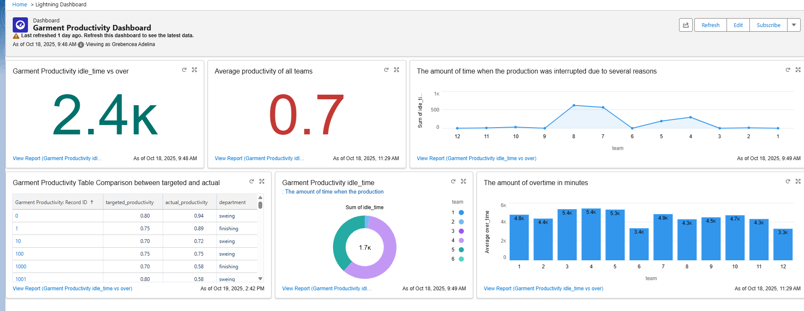

# Optimization-employees-productivity-system-with-Salesforce-
In this learning project i tried to discover all Salesforce's features creating an optimization platform. 

This project focuses on automating productivity analysis, monitoring, and team performance management within Salesforce using Reports, Dashboards, and Flows.
The goal is to identify low-performing teams, automatically create investigation tasks, and later integrate predictive analytics using AI/ML.

What it does:
Visualizes the difference between Targeted Productivity and Actual Productivity across departments or teams.
Includes:
* A Bar Chart for comparing actual_productivity vs targeted_productivity.
* A Scatter Chart for visualizing the relationship between idle_time and over_time.
* Conditional Formatting to highlight records below the target threshold (red for underperforming teams, yellow for high idle time).
Purpose:
This provides managers a clear, data-driven view of operational efficiency and identifies where interventions are needed.

⚙️ 2. scheduled_flow_builder.png

This image captures the Salesforce Flow Builder setup — an automation designed to monitor garment productivity records and take actions automatically.

Purpose:
Automates the detection of low productivity and ensures that investigation actions are tracked directly in Salesforce.

📝 3. investigated_low_prod_teams.png

This screenshot shows the automatically generated Tasks created by the Flow for teams below target.

Purpose:
Transforms data insights into actionable items, closing the loop between monitoring and response.

🤖 In Progress: AI/ML Integration

The next phase of this project involves integrating Einstein AI or an external Python-based ML model to predict actual_productivity__c based on other variables, such as:
* smv, idle_time, wip, incentive, no_of_workers, etc.
Planned outcome:
* Predict real productivity trends in advance.
* Generate proactive recommendations (e.g., which teams are likely to underperform).
* Display predictions and suggestions directly on the Dashboard.
Currently, this integration is in progress — initial exploration of Einstein Generative AI and Flow Creation with Einstein features has started, but full predictive functionality is not yet implemented.
This screenshot shows the Salesforce Dashboard built from a custom report on the Garment_Productivity__c object.
